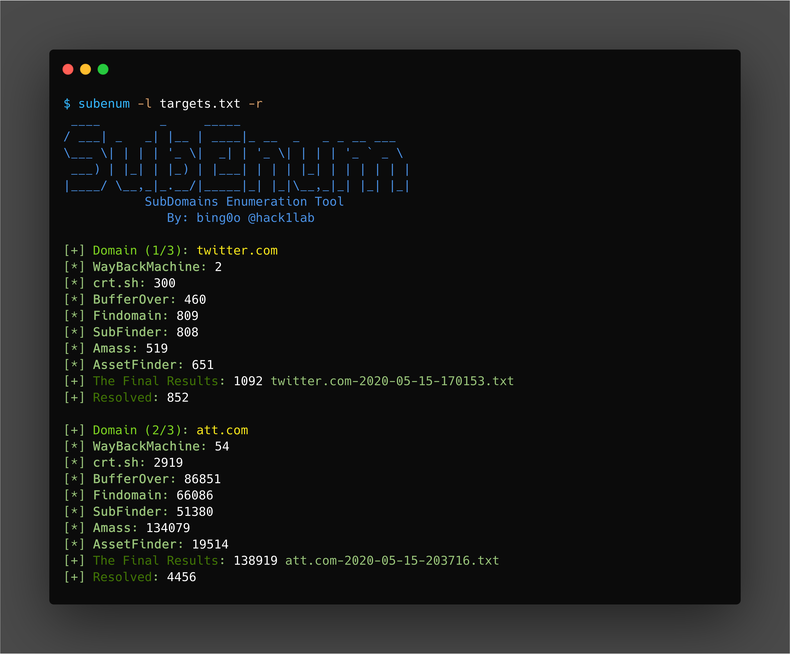

## Description:

bash script for Subdomain Enumeration using 4 tools and 3 APIs, you have to install these tools by yourself to be able to use SubEnum.sh 



### Available Tools and APIs:

1. Tools:
	- [Findomain](https://github.com/Edu4rdSHL/findomain)
	- [SubFinder](https://github.com/projectdiscovery/subfinder)
	- [Amass](https://github.com/OWASP/Amass)
	- [AssetFinder](https://github.com/tomnomnom/assetfinder)
	- [Httprobe](https://github.com/tomnomnom/httprobe), To Probe For Working HTTP and HTTPS Subdomains.
1. APIs:
	- [WayBackMachine](http://web.archive.org/)
	- [crt.sh](https://crt.sh/)
	- [BufferOver](https://dns.bufferover.run/)


## Usage:

### Basic usage:

```bash
$ subenum -d target.com 
```

### Resolve The Found Subdomains:

```bash
$ subenum -d target.com -r 
```

### Agains a list of domains

```bash
$ subenum -l domains.txt -r
```

### Exclude:

```bash
$ subenum -d target.com -e Amass,wayback
```

### Use:

```bash
$ subenum -d target.com -u Findomain,Subfinder
```

exclude and use can be used with list of domains too 

```bash
$ subenum -l domains.txt -u crt,bufferover
```

happy hacking!


## thanks goes to:

[@secfb](https://github.com/secfb): for the idea of adding the option `-r/--resolve` to resolve the found subdomains, [issue](https://github.com/bing0o/SubEnum/issues/1).